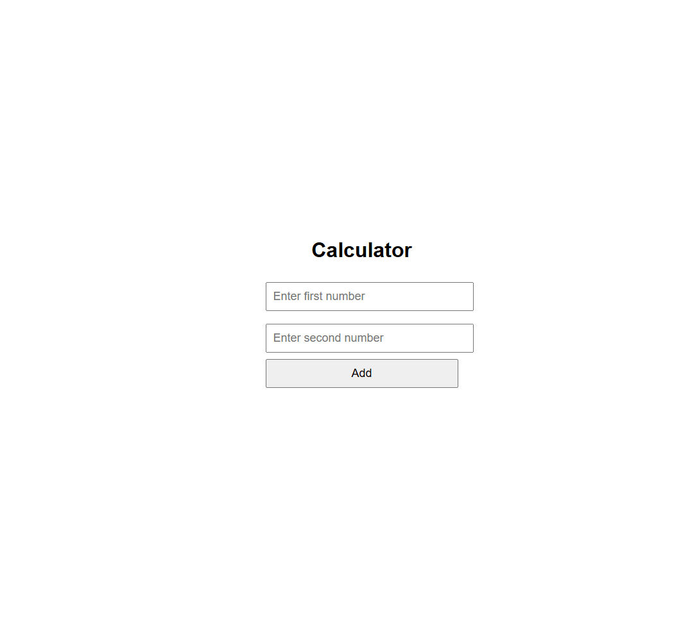
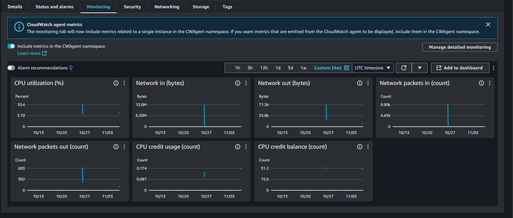

# ☁️ Cloud Calculator - Python Flask Web App

Este projeto é uma **calculadora web** desenvolvida em Python com Flask, focada em treinar o deploy na **AWS EC2** e configurar um servidor Ubuntu em ambiente de produção.

---

## 📸 Pré-visualizações

### Interface da Calculadora

  

### Dashboard da AWS

  

---

## 🔍 O que foi feito

- Configuração de uma instância EC2 na **AWS** (Ubuntu `t2.micro`).
- Criação de grupos de segurança para liberar **SSH** e **HTTP**.
- Configuração de um ambiente virtual Python e instalação do **Flask**.
- Deploy do projeto e monitoramento de custos na AWS.

---

📚 *Projeto desenvolvido para praticar deploy e configuração de servidores na nuvem com AWS e Python Flask.*
